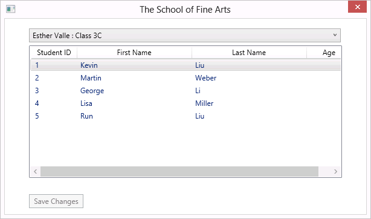

# Module 1: Review of Visual C# Syntax

## Lab: Developing the Class Enrollment Application

### Scenario

You are a Microsoft Visual C# developer working for a software development company that is writing applications for The School of Fine Arts, an elementary school for gifted children.
The school administrators require an application that they can use to enroll students in a class. The application must enable an administrator to add and remove students from classes, as well as to update the details of students.
You have been asked to write the code that implements the business logic for the application.

>**Note :** During the labs for the first two modules in this course, you will write code for this class enrollment application.
When The School of Fine Arts ask you to extend the application functionality, you realize that you will need to test proof of concept and obtain client feedback before writing the final application, so in the lab for Module 3, you will begin developing a prototype application and continue with this until then end of Module 8.
In the lab for Module 9, after gaining signoff for the final application, you will develop the user interface for the production version of the application, which you will work on for the remainder of the course.

### Objectives

After completing this lab, you will be able to:

- Write Visual C# code that implements the logic necessary to edit the details of a student.
- Write Visual C# code that implements the logic necessary to add new students.
- Write Visual C# code that implements the logic necessary to remove students from a class.
- Perform simple data transformations to display information.

### Lab Setup

Estimated Time: **105 minutes**

### Exercise 1: Implementing Edit Functionality for the Students List

#### Scenario

In this exercise, you will write the code that enables an administrator who is using the application to edit a student’s details.
A list of students is displayed in the user interface of the application. When the user selects a student and then presses a key on the keyboard, you will check whether the key they pressed was Enter.
If they did press Enter, you will write code to display the student’s details in a separate form, which the user can use to modify the details.
When the user closes the form, you will copy the updated details back to the list box displaying the list of students.
Finally, you will run the application to verify that your code functions as expected, and then use the debugging tools to examine code as it runs.

#### Task 1: Detect whether the user has pressed the Enter key

1. Start File Explorer, navigate to the **[Repository Root]\\Allfiles\\Mod01\\Labfiles\\Databases** folder, and then run **SetupSchoolDB.cmd**.
2. Close File Explorer.
3. Start Visual Studio and from the **[Repository Root]\\Allfiles\\Mod01\\Labfiles\\Starter\\Exercise1** folder, open the **School.sln** solution.
4. In the code for the **MainWindow.xaml.cs** window, find the **studentsList_KeyDown** method.
5. In this method, add a **switch** statement to detect whether the user has pressed Enter.  
   The second argument passed to this method is a **KeyEventArgs** object named **e**. This object has a **Key** property which returns the keyboard key
   associated with the event. You can use this in conjunction with the **Key** enumeration to determine which key initiated the **KeyDown** event.
6. If the user pressed Enter, store the selected student in a **Student** object variable.

#### Task 2: Initialize the StudentForm window and populate it with the details of the currently selected student

1. If the user has pressed the Enter key, create a new instance of the **StudentForm** window named **sf** and set the **Title** property of the window to **Edit Student Details**.
2. Populate the following text boxes on the form with the corresponding properties of the current student:
    - firstName
    - lastName
    - dateOfBirth
   To store data in a text box in a window, set the **Text** property of the text box to the required string.
3. Display the date of birth by using the standard short date format without the time element by using the “d” format specifier as shown in the following code:
    ```cs
    sf.dateOfBirth.Text = student.DateOfBirth.ToString("d");
    ```

#### Task 3: Display the StudentForm window and copy the updated student details entered back to the Student object

1. At the end of the **case Key.Enter** block, display the **StudentForm** window by using the **ShowDialog** method of the form.
2. If the user clicks **OK** in the **StudentForm** window, copy the updated student details from the **StudentForm** window back to the **Student** object.  
   You can detect whether the user clicked the **OK** button by examining the return value of the **ShowDialog** method. If the **Value** property of this
   is true, the user clicked **OK**, otherwise they clicked **Cancel**.  
   You can use the **DateTime.Parse** method to convert the date of birth string from the text box to a **DateTime** type.
3. If the user clicks **OK**, also enable the **Save Changes** button in the user interface.  
   To enable an item in a user interface, set the **IsEnabled** property of the item to **true**.

#### Task 4: Run the application and verify that the edit functionality works as expected

1. Build the solution and resolve any compilation errors.
2. Run the application and verify that it displays the initial list of students.  
   
3. Edit the row for **Kevin Liu** and verify that the **Edit Student Details** window appears and displays the correct details:  
   
4. Change the last name of **Kevin Liu** to **Cook** and verify that the updated data is copied back to the students list.
5. Verify that the **Save Changes** button is now enabled.
6. Close the application.

#### Task 5: Use the Visual Studio Debugger to step through the code

1. In Visual Studio, in the **studentsList_KeyDown** method, insert a breakpoint at the statement that sets the **Title** property of the **StudentForm**.
2. Debug the application.
3. Edit the row for **George Li**.
4. When Visual Studio enters break mode, open the **Watch 1** window that automatically appears in the tab group in the bottom left window and populate the grid with a row for each of the following:
    - **sf.Title**
    - **sf.firstName.Text**
    - **sf.lastName.Text**
    - **sf.dateOfBirth.Text**
5. Step over the next code statement four times.
6. Use the **Immediate Window** that automatically appears in the tab group in the bottom middle window to view the value of **sf.firstName.Text** and to verify that it contains the value **George**.
7. In the **Watch 1** window, change the value **George** to **Dominik**.
8. In the **Immediate Window**, enter **sf.lastName.Text** and verify that the value **"Li"** is displayed.
9. Enter code to change the **sf.lastName.Text** value to **"Dubicki"**, and then verify that value changes in the **Watch 1** window.

    | **Field**     | **Value**     |
    | ------------- |:-------------:|
    | First Name    | Dominik       |
    | Last Name     | Dubicki       |
    | Date of Birth | 8/10/2005     |

10. Stop debugging the application.
11. In Visual Studio, on the **Debug** menu, click **Delete All Breakpoints**, and then close the solution.

>**Result :** After completing this exercise, users will be able to edit the details of a student.

### Exercise 2: Implementing Insert Functionality for the Students List

#### Scenario

In this exercise, you will write code that enables an administrator who is using the application to add a new student to the students list.
A list of students is displayed in the user interface of the application. When the user presses a key on the keyboard, you will check whether the key they pressed was Insert.
If they did press Insert, you will write code to display a form in which the user can enter the details of a new student, including their first name, last name, and date of birth.
When the user closes the form, you will add the new student to the list of students and display the details in the list box.
Finally, you will run the application to verify that your code functions as expected.

#### Task 1: Add logic to the key down method to detect if the Insert key has been pressed

1. In Visual Studio, from the **[Repository Root]\Allfiles\Mod01\Labfiles\Starter\Exercise 2** folder, open the **School.sln** solution.
2. In the code for the **MainWindow.xaml.cs** window, locate the **studentsList_KeyDown** method.
3. In this method, add a statement to detect whether the user has pressed Insert.

#### Task 2: Initialize the student form

1. If the user has pressed Insert, create a new instance of the **StudentForm** window.
2. Set the **Title** property of the window to **New Student for Class** appended to the **Class** property of the **teacher** object. Use code similar to the following to create the string for the **Title** property.
    ```cs
    "New Student for Class " + teacher.Class
    ```

#### Task 3: Display the StudentForm window and enable the user to provide the details of the new student

1. Display the **StudentForm** window by using the **ShowDialog** method.
2. If the user clicks the **OK** button in the**StudentForm** window, create a new student object and copy the student details from the **StudentForm** window to the new student object.

#### Task 4: Assign the new student to a class and enable the user to save the details of the new student

1. In the **StudentForm** window, if the user clicks the **OK** button , use the **Students.Add** method of the current teacher to assign the new student to a class. You can use **This.Teacher** to access the current teacher.
2. Add the new student object to the list of students displayed on the form.
3. Enable the **Save Changes** button in the user interface.

#### Task 5: Run the application and verify that the insert functionality works as expected

1. Build the solution and resolve any compilation errors.
2. Run the application and verify that it displays the initial list of students.
3. Display the new student window and verify that it contains no data.
4. Insert the details for **Darren Parker**, date of birth is **02/03/2006**, and verify that the new student is added to the students list. The ID of a new student will be **0** until their details are saved to the database in the next lab.
5. Verify that the **Save Changes** button is now enabled.
6. Close the application.
7. In Visual Studio, close the solution.

>**Result :** After completing this exercise, users will be able to add new students to a class.

### Exercise 3: Implementing Delete Functionality for the Students List

#### Scenario

In this exercise, you will write code that enables an administrator to remove a student from the students list.
A list of students is displayed in the user interface of the application. If the user selects a student and then presses a key on the keyboard, you will check whether the key they pressed was Delete.
If they did press Delete, the application will prompt the user to confirm that they want to remove the selected student from the class. If they do, the student will be deleted from the student list for the appropriate class, otherwise nothing changes.
Finally, you will run the application to verify that your code functions as expected.

#### Task 1: Add logic to the key down method to detect if the Delete key has been pressed

1. In Visual Studio, from the **[Repository Root]\Allfiles\Mod01\Labfiles\Starter\Exercise 3** folder, open the **School.sln** solution.
2. In the code for the **MainWindow.xaml.cs** window, find the **studentsList_KeyDown** method.
3. In this method, add a statement to detect whether the user has pressed the Delete key.

#### Task 2: Prompt the user to confirm that they want to remove the selected student from the class

1. If the user presses Delete, find the details of the student that the user has selected and display a message box showing the selected student’s name. Ask the user to confirm that they want to remove the student.  
   

#### Task 3: Remove the student and enable the user to save the changes

1. If the user confirms that they want to delete the student's details, delete the current student object from the **schoolContext.Students** collection and enable the **Save Changes** button in the user interface.

#### Task 4: Run the application and verify that the delete functionality works as expected

1. Build the solution and resolve any compilation errors.
2. Run the application and verify that it displays the initial list of students.
3. Delete the student **Jon Orton** from class **4B**.
4. Verify that the prompt dialog box appears, the student is removed from the list, and that the **Save Changes** button is enabled.
5. Close the application.
6. In Visual Studio, close the solution.

>**Result :** After completing this exercise, users will be able to remove students from classes.

### Exercise 4: Displaying a Student’s Age

#### Scenario

In this exercise, you will update the application to display a student’s age instead of their date of birth.
You will write code in the **AgeConverter** class that is linked to the grid column displaying student ages.
In this class, you will write code to work out the difference between the current date and the date of birth of the student, and then convert this value into years.
Then you will run the application to verify that the **Age** column now displays age in years instead of the date of birth.

#### Task 1: Examine the MainWindow XAML

1. In Visual Studio, from the **[Repository Root]\Allfiles\Mod01\Labfiles\Starter\Exercise 4** folder, open the **School.sln** solution.
2. Build the solution.
3. View the **MainWindow.xaml** code.
4. Note how the **Age** column in **GridView** uses databinding with a value converter (**AgeConverter**).

#### Task 2: Add logic to the AgeConverter class to calculate a student’s age from their date of birth

1. In the code for the **MainWindow.xaml.cs** window, in the **AgeConverter** class, find the **Convert** method.
2. In this method, add code that checks that the **value** parameter of the method contains data. If it does not, return an empty string.
3. If the **value** parameter is not null, convert the **value** parameter to a **DateTime** object.
4. Calculate the difference between the current date and the student’s date of birth by using the **DateTime.Now.Subtract** method to subtract the date of birth from the current date and store the result in a **TimeSpan** object.
5. Convert the result into number of years by using the **TimeSpan.Days** method to retrieve the difference in days and then using the following formula to calculate the age in years.
   Age in years = difference in days / 365.25
6. Convert the number of years into a string and return it to the calling method.

#### Task 3: Run the application and verify that the student’s age now appears correctly

1. Build the solution and resolve any compilation errors.
2. Run the application and verify that it displays the initial list of students, with their ages.  
   
3. Add yourself as a student and verify that your age displays correctly in the student list.
4. Close the application.
5. In Visual Studio, close the solution.

>**Result :** After completing this exercise, the application will display a student’s age in years.

©2018 Microsoft Corporation. All rights reserved.

The text in this document is available under the  [Creative Commons Attribution 3.0 License](https://creativecommons.org/licenses/by/3.0/legalcode), additional terms may apply. All other content contained in this document (including, without limitation, trademarks, logos, images, etc.) are  **not**  included within the Creative Commons license grant. This document does not provide you with any legal rights to any intellectual property in any Microsoft product. You may copy and use this document for your internal, reference purposes.

This document is provided &quot;as-is.&quot; Information and views expressed in this document, including URL and other Internet Web site references, may change without notice. You bear the risk of using it. Some examples are for illustration only and are fictitious. No real association is intended or inferred. Microsoft makes no warranties, express or implied, with respect to the information provided here.
