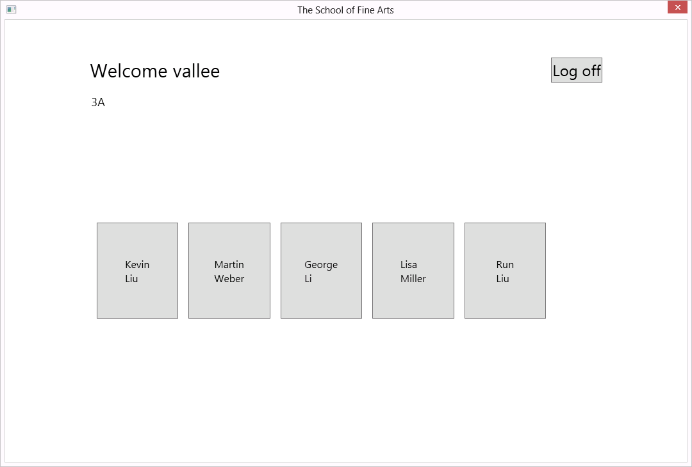

# Module 3: Developing the Code for a Graphical Application

## Lab: Writing the Code for the Grades Prototype Application

### Lab Setup

Estimated Time: **90 minutes**

### Preparation Steps

Ensure that you have cloned the 20483C directory from GitHub. It contains the code segments for this course's labs and demos. (**https://github.com/MicrosoftLearning/20483-Programming-in-C-Sharp/tree/master/Allfiles**)

### Exercise 1: Adding Navigation Logic to the Grades Prototype Application

#### Task 1: Examine the window and views in the application

1. Click **Visual Studio 2017**.
2. In **Visual Studio**, on the **File** menu, point to **Open**, and then click **Project/Solution**.
3. In the **Open Project** dialog box, browse to **[Repository Root]\Allfiles\Mod03\Labfiles\Starter\Exercise 1**, click **GradesPrototype.sln**, and then click **Open**.
   >**Note :** If any Security warning dialog box appears, clear **Ask me for every project in this solution** check box and then click **OK**.
4. On the **Build** menu, click **Build Solution**.
5. In **Solution Explorer**, expand **GradesPrototype**, and then double-click **MainWindow.xaml**.
6. Note that this is the main window for the application that will host the following views:
   - **LogonPage.xaml**
   - **StudentProfile.xaml**
   - **StudentsPage.xaml**
7. In **Solution Explorer**, expand **Views**, and then double-click **LogonPage.xaml**.
8. Notice that this view contains text boxes for the username and password, a check box to identify the user as a teacher, and a button to log on to the application.
9. In **Solution Explorer**, double-click **StudentProfile.xaml**.
10. Notice that this view contains a report card that currently displays a list of dummy grades. The view also contains a **Back** button and a blank space that will display the student’s name. This view is displayed when a student logs on or when a teacher views a student’s profile.
11. In **Solution Explorer**, double-click **StudentsPage.xaml**.
12. Notice that this view contains the list of students in a particular class. This view is displayed when a teacher logs on. A teacher can click a student’s name and the **Students Profile** view will be displayed, containing the selected student’s data.

#### Task 2: Define the LogonSuccess event and add dummy code for the Logon_Click event

1. On the **View** menu, click **Task List**.
2. In the **Task List** window, choose **Entire Solution** option from the list on the left side.
3. Double-click the **TODO: Exercise 1: Task 2a: Define the LogonSuccess event handler** task.
4. In the code editor, click in the blank line below the comment, and then type the following code:
    ```cs
    public event EventHandler LogonSuccess;
    ```
5. In the **Task List** window, double-click the **TODO: Exercise 1: Task 2b: Implement the Logon_Click event handler for the Logon button** task.
6. In the code editor, click in the blank line below the comments, and then type the following code:
    ```cs
    private void Logon_Click(object sender, RoutedEventArgs e)
    {
        // Save the username and role (type of user) specified on the form in the   global context
        SessionContext.UserName = username.Text;
        SessionContext.UserRole = (bool)userrole.IsChecked ? Role.Teacher : Role.Student;

        // If the role is Student, set the CurrentStudent property in the global    context to a dummy student; Eric Gruber
        if (SessionContext.UserRole == Role.Student)
        {
            SessionContext.CurrentStudent = "Eric Gruber";
        }

        // Raise the LogonSuccess event
        if (LogonSuccess != null)
        {
            LogonSuccess(this, null);
        }
    }
    ```
7. In **Solution Explorer**, double-click **LogonPage.xaml**.
8. In the XAML editor, locate the task **TODO: Exercise 1: Task 2c: Specify that the Logon button should raise the Logon_Click event handler in this view** task.
9. In the line below the comment, modify the XAML markup
    ```xml
    <Button Grid.Row="3" Grid.ColumnSpan="2" VerticalAlignment="Center" HorizontalAlignment="Center" Content="Log on" FontSize="24" \>
    ```
    to look like the following markup:
    ```xml
    <Button Grid.Row="3" Grid.ColumnSpan="2" VerticalAlignment="Center" HorizontalAlignment="Center" Content="Log on" FontSize="24" Click="Logon_Click" />
    ```

#### Task 3: Add code to display the Log On view

1. In the **Task List** window, double-click the **TODO: Exercise 1: Task 3a: Display the logon view and hide the list of students and single student view** task.
2. In the code editor, click in the blank line in the **GotoLogon** method, and then type the following code:
    ```cs
    // Display the logon view and hide the list of students and single student view
    logonPage.Visibility = Visibility.Visible;
    studentsPage.Visibility = Visibility.Collapsed;
    studentProfile.Visibility = Visibility.Collapsed;
    ```
3. In the **Task List** window, double-click the **TODO: Exercise 1: Task 3b: Handle successful logon** task.
4. In the code editor, click in the blank line below the comments, and then type the following code:
    ```cs
    // Handle successful logon
    private void Logon_Success(object sender, EventArgs e)
    {
        // Update the display and show the data for the logged on user
        logonPage.Visibility = Visibility.Collapsed;
        gridLoggedIn.Visibility = Visibility.Visible;
        Refresh();
    }
    ```
5. In **Solution Explorer**, double-click **MainWindow.xaml**.
6. In the XAML editor, locate the task **TODO: Exercise 1: Task 3c: Catch the LogonSuccess event and call the Logon_Success event handler (to be created)** task.
7. In the line below the comment, modify the XAML markup
    ```xml
    <y:LogonPage x:Name="logonPage"  Visibility="Collapsed" />
    ```
    to look like the following markup:
    ```xml
    <y:LogonPage x:Name="logonPage" LogonSuccess="Logon_Success" Visibility="Collapsed" />
    ```

#### Task 4: Add code to determine the type of user

1. In the **Task List** window, double-click the **TODO: Exercise 1: Task 4a: Update the display for the logged on user (student or teacher)** task.
2. In the code editor, click in the blank line in the **Refresh** method, and then type the following code:
    ```cs
    switch (SessionContext.UserRole)
    {
        case Role.Student:
            // Display the student name in the banner at the top of the page
            txtName.Text = string.Format("Welcome {0}", SessionContext.UserName);

            // Display the details for the current student
            GotoStudentProfile();
            break;

        case Role.Teacher:
            // Display the teacher name in the banner at the top of the page
            txtName.Text = string.Format("Welcome {0}", SessionContext.UserName);

            // Display the list of students for the teacher
            GotoStudentsPage();
            break;
    }
    ```
3. In the **Task List** window, double-click the **TODO: Exercise 1: Task 4b: Display the details for a single student** task.
4. In the code editor, click in the blank line in the **GotoStudentProfile** method, and then type the following code:
    ```cs
    // Hide the list of students
    studentsPage.Visibility = Visibility.Collapsed;

    // Display the view for a single student
    studentProfile.Visibility = Visibility.Visible;
    studentProfile.Refresh();
    ```
5. In the **Task List** window, double-click the **TODO: Exercise 1: Task 4c: Display the list of students** task.
6. In the code editor, click in the blank line in the **GotoStudentsPage** method, and then type the following code:
    ```cs
    // Hide the view for a single student (if it is visible)
    studentProfile.Visibility = Visibility.Collapsed;

    // Display the list of students
    studentsPage.Visibility = Visibility.Visible;
    studentsPage.Refresh();
    ```
7. In the **Task List** window, double-click the **TODO: Exercise 1: Task 4d: Display the details for the current student including the grades for the student** task.
8. In the code editor, click in the blank line in the **Refresh** method, and then type the following code:
    ```cs
    // Parse the student name into the first name and last name by using a regular expression
    // The firstname is the initial string up to the first space character.
    // The lastname is the string after the space character
    Match matchNames = Regex.Match(SessionContext.CurrentStudent, @"([^ ]+) ([^ ]+)");

    if (matchNames.Success)
    {
        string firstName = matchNames.Groups[1].Value; // Indexing in the Groups collection starts at 1, not 0
        string lastName = matchNames.Groups[2].Value;

        // Display the first name and last name in the TextBlock controls in the studentName StackPanel
        ((TextBlock)studentName.Children[0]).Text = firstName;
        ((TextBlock)studentName.Children[1]).Text = lastName;
    }

    // If the current user is a student, hide the Back button
    // (only applicable to teachers who can use the Back button to return to the list of students)
    if (SessionContext.UserRole == Role.Student)
    {
        btnBack.Visibility = Visibility.Hidden;
    }
    else
    {
        btnBack.Visibility = Visibility.Visible;
    }
    ```

#### Task 5: Handle the Student_Click event

1. In the **Task List** window, double-click the **TODO: Exercise 1: Task 5a: Handle the click event for a student** task.
2. In the code editor, click in the blank line in the **Student_Click** method, and then type the following code:
    ```cs
    Button itemClicked = sender as Button;
    if (itemClicked != null)
    {
        // Find out which student was clicked - the Tag property of the button  contains the name
        string studentName = (string)itemClicked.Tag;
        if (StudentSelected != null)
        {
            // Raise the StudentSelected event (handled by MainWindow) to display the   details for this student
            StudentSelected(sender, new StudentEventArgs(studentName));
        }
    }
    ```
3. In the **Task List** window, double-click the **TODO: Exercise 1: Task 5b: Handle the StudentSelected event when the user clicks a student on the Students page** task.
4. In the code editor, click in the blank line in the **studentsPage_StudentSelected** method, and then type the following code:
    ```cs
    SessionContext.CurrentStudent = e.Child;
    GotoStudentProfile();
    ```
5. In **Solution Explorer**, double-click **MainWindow.xaml**.
6. In the XAML editor, locate the task **TODO: Exercise 1: Task 5c: Catch the StudentSelected event and call the studentsPage_StudentSelected event handler** task.
7. In the line below the comment, modify the XAML markup
    ```xml
    <y:StudentsPage x:Name="studentsPage" Visibility="Collapsed" />
    ```
    to look like the following markup:
    ```xml
    <y:StudentsPage x:Name="studentsPage" StudentSelected="studentsPage_StudentSelected" Visibility="Collapsed" />
    ```

#### Task 6: Build and test the application

1. On the **Build** menu, click **Build Solution**.
2. On the **Debug** menu, click **Start Without Debugging**.
3. When the application loads, in the **Username** text box, type **vallee**, and in the **Password** text box, type **password**.
4. Select the **Teacher** check box, and then click **Log on**.
5. Verify that the application displays the **StudentPage** view.
    
6. Click the student **Kevin Liu** and verify that the application displays the **StudentProfile** view.
    
7. Click **Log off**.
8. In the **Username** text box, delete the existing contents, and then type **grubere**.
9. Clear the **Teacher** check box, and then click **Log on**.
10. Verify that the application displays the student profile page for **Eric Gruber**.
11. Close the application.
12. On the **File** menu, click **Close Solution**.

>**Result:** After completing this exercise, you should have updated the **Grades Prototype** application to respond to user events and move among the application views appropriately.

### Exercise 2: Creating Data Types to Store User and Grade Information

#### Task 1: Define basic structs for holding Grade, Student, and Teacher information

1. In **Visual Studio**, on the **File** menu, point to **Open**, and then click **Project/Solution**.
2. In the **Open Project** dialog box, browse to **[Repository Root]\Allfiles\Mod03\Labfiles\Starter\Exercise 2**, click **GradesPrototype.sln**, and then click **Open**.
   >**Note :** If any Security warning dialog box appears, clear **Ask me for every project in this solution** check box and then click **OK**.
3. On the **View** menu, click **Task List**.
4. In the **Task List** window, double-click the **TODO: Exercise 2: Task 1a: Create the Grade struct** task.
5. In the code editor, click in the blank line below the comment, and then type the following code:
    ```cs
    public struct Grade
    {
        public int StudentID { get; set; }
        public string AssessmentDate { get; set; }
        public string SubjectName { get; set; }
        public string Assessment { get; set; }
        public string Comments { get; set; }
    }
    ```
6. In the **Task List** window, double-click the **TODO: Exercise 2: Task 1b: Create the Student struct** task.
7. In the code editor, click in the blank line below the comment, and then type the following code:
    ```cs
    public struct Student
    {
        public int StudentID { get; set; }
        public string UserName { get; set; }
        public string Password { get; set; }
        public int TeacherID { get; set; }
        public string FirstName { get; set; }
        public string LastName { get; set; }
    }
    ```
8. In the **Task List** window, double-click the **TODO: Exercise 2: Task 1c: Create the Teacher struct** task.
9. In the code editor, click at the end of the comment line, press Enter, and then type the following code:
    ```cs
    public struct Teacher
    {
        public int TeacherID { get; set; }
        public string UserName { get; set; }
        public string Password { get; set; }
        public string FirstName { get; set; }
        public string LastName { get; set; }
        public string Class { get; set; }
    }
    ```

#### Task 2: Examine the dummy data source used to populate the collections

1. In **Solution Explorer**, expand **GradesPrototype**, expand **Data**, and then double-click **DataSource.cs**.
2. In the code editor, expand the region **Sample Data**, and then locate the method **CreateData**.
3. Note how the **Teachers ArrayList** is populated with **Teacher** data, each containing **TeacherID**, **UserName**, **Password**, **FirstName**, **LastName**, and **Class** fields.
4. Note how the **Students ArrayList** is populated with **Student** data, each containing **StudentID**, **UserName**, **Password**, **TeacherID**, **FirstName**, and **LastName** fields.
5. Note how the **Grades ArrayList** is populated with **Grade** data, each containing **StudentID**, **AssessmentDate**, **SubjectName**, **Assessment**, and **Comments** fields.
6. On the **File menu**, click **Close Solution**.

>**Result:** After completing this exercise, the application will contain structs for the teacher, student, and grade types.

### Exercise 3: Displaying User and Grade Information

#### Task 1: Add the LogonFailed event

1. In **Visual Studio**, on the **File** menu, point to **Open**, and then click **Project/Solution**.
2. In the **Open Project** dialog box, browse to **[Repository Root]\Allfiles\Mod03\Labfiles\Starter\Exercise 3**, click **GradesPrototype.sln**, and then click **Open**.
   >**Note :** If any Security warning dialog box appears, clear **Ask me for every project in this solution** check box and then click **OK**.
3. In the **Task List** window, double-click the **TODO: Exercise 3: Task 1a: Define LogonFailed event** task.
4. In the code editor, click in the blank line below the comment, and then type the following code:
    ```cs
    public event EventHandler LogonFailed;
    ```
5. In the **Task List** window, double-click the **TODO: Exercise 3: Task 1b: Validate the username and password against the Users collection in the MainWindow window** task.
6. In the code editor, in the **Logon_Click** method, click in the blank line, and then type the following code:
    ```cs
    // Find the user in the list of possible users - first check whether the user is a  teacher
    var teacher = (from Teacher t in DataSource.Teachers
                   where String.Compare(t.UserName, username.Text) == 0 &&
                         String.Compare(t.Password, password.Password) == 0
                   select t).FirstOrDefault();

    // If the UserName of the user retrieved by using LINQ is non-empty then the user is a teacher
    if (!String.IsNullOrEmpty(teacher.UserName))
    {
        // Save the UserID and Role (teacher or student) and UserName in the global context
        SessionContext.UserID = teacher.TeacherID;
        SessionContext.UserRole = Role.Teacher;
        SessionContext.UserName = teacher.UserName;
        SessionContext.CurrentTeacher = teacher;

        // Raise the LogonSuccess event and finish
        LogonSuccess(this, null);
        return;
    }
    // If the user is not a teacher, check whether the username and password match those of a student
    else
    {
        var student = (from Student s in DataSource.Students
                       where String.Compare(s.UserName, username.Text) == 0 &&
                             String.Compare(s.Password, password.Password) == 0
                       select s).FirstOrDefault();

        // If the UserName of the user retrieved by using LINQ is non-empty then the user is a student
        if (!String.IsNullOrEmpty(student.UserName))
        {
            // Save the details of the student in the global context
            SessionContext.UserID = student.StudentID;
            SessionContext.UserRole = Role.Student;
            SessionContext.UserName = student.UserName;
            SessionContext.CurrentStudent = student;

            // Raise the LogonSuccess event and finish
            LogonSuccess(this, null);
            return;
        }
    }

    // If the credentials do not match those for a Teacher or for a Student then they must be invalid
    // Raise the LogonFailed event
    LogonFailed(this, null);
    ```

#### Task 2: Add the Logon_Failed event handler

1. In the **Task List** window, double-click the **TODO: Exercise 3: Task 2a: Handle logon failure** task.
2. In the code editor, click in the blank line below the comments, and then type the following code:
    ```cs
    private void Logon_Failed(object sender, EventArgs e)
    {
        // Display an error message. The user must try again
        MessageBox.Show("Invalid Username or Password", "Logon Failed", MessageBoxButton.OK, MessageBoxImage.Error);
    }
    ```
3. In **Solution Explorer**, double-click **MainWindow.xaml**.
4. In the XAML editor, locate the task **TODO: Exercise 3: Task 2b: Connect the LogonFailed event of the logonPage view to the Logon_Failed method in MainWindow.xaml.cs** task.
5. In the line below the comment, modify the XAML markup
    ```xml
    <y:LogonPage x:Name="logonPage" LogonSuccess="Logon_Success" Visibility="Collapsed" />
    ```
    to look like the following markup:
    ```xml
    <y:LogonPage x:Name="logonPage" LogonSuccess="Logon_Success" LogonFailed="Logon_Failed" Visibility="Collapsed" />
    ```
6. In the **Task List** window, double-click the **TODO: Exercise 3: Task 2c: Display the student name in the banner at the top of the page** task.
7. In the code editor, click in the blank line below the comment, and then type the following code:
    ```cs
    // Display the student name in the banner at the top of the page
    txtName.Text = string.Format("Welcome {0} {1}", SessionContext.CurrentStudent.FirstName, SessionContext.CurrentStudent.LastName);
    ```
8. In the **Task List** window, double-click the **TODO: Exercise 3: Task 2d: Display the teacher name in the banner at the top of the page** task.
9. In the code editor, click in the blank line below the comment, and then type the following code:
    ```cs
    // Display the teacher name in the banner at the top of the page
    txtName.Text = string.Format("Welcome {0} {1}", SessionContext.CurrentTeacher.FirstName, SessionContext.CurrentTeacher.LastName);
    ```

#### Task 3: Display the students for the current teacher

1. In **Solution Explorer**, expand **Views**, and then double-click **StudentsPage.xaml**.
2. In the XAML editor, locate the **ItemsControl** named **list** and note how data binding is used to display the name of each student.
   >**Note:** DataBinding is also used to retrieve the StudentID of a student. This binding is used when a user clicks on a student on the **Student Page** list to identify the student whose data is to be displayed in the **Student Profile** page.
3. In the **Task List** window, double-click the **TODO: Exercise 3: Task 3a: Display students for the current teacher (held in SessionContext.CurrentTeacher)** task.
4. In the code editor, in the **Refresh** method, click in the blank line, and then type the following code:
    ```cs
    // Find students for the current teacher
    ArrayList students = new ArrayList();

    foreach (Student student in DataSource.Students)
    {
        if (student.TeacherID == SessionContext.CurrentTeacher.TeacherID)
        {
            students.Add(student);
        }
    }

    // Bind the collection to the list item template
    list.ItemsSource = students;

    // Display the class name
    txtClass.Text = String.Format("Class {0}", SessionContext.CurrentTeacher.Class);
    ```
5. In the **Task List** window, double-click the **TODO: Exercise 3: Task 3b: If the user clicks on a student, display the details for that student** task.
6. In the code editor, in the **Student_Click** method, click in the blank line, and then type the following code:
    ```cs
    Button itemClicked = sender as Button;

    if (itemClicked != null)
    {
        // Find out which student was clicked
        int studentID = (int)itemClicked.Tag;

        if (StudentSelected !=null)
        {
            // Find the details of the student by examining the DataContext of the Button
            Student student = (Student)itemClicked.DataContext;

            // Raise the StudentSelected event (handled by MainWindow to display the details for this student
            StudentSelected(sender, new StudentEventArgs(student));
        }
    }
    ```
7. In the **Task List** window, double-click the **TODO: Exercise 3: Task 3c: Set the current student in the global context to the student specified in the StudentEventArgs parameter** task.
8. In the code editor, click in the blank line below the comment, and then type the following code:
    ```cs
    SessionContext.CurrentStudent = e.Child;
    ```

#### Task 4: Set the DataContext for the page

1. In the **Task List** window, double-click the **TODO: Exercise 3: Task 4a: Display the details for the current student (held in SessionContext.CurrentStudent)** task.
2. In the code editor, click in the blank line below the comment, and then type the following code:
    ```cs
    // Bind the studentName StackPanel to display the details of the student in the TextBlocks in this panel
    studentName.DataContext = SessionContext.CurrentStudent;

    // If the current user is a student, hide the Back button
    // (only applicable to teachers who can use the Back button to return to the list of students)
    if (SessionContext.UserRole == Role.Student)
    {
        btnBack.Visibility = Visibility.Hidden;
    }
    else
    {
        btnBack.Visibility = Visibility.Visible;
    }
    ```
3. In **Solution Explorer**, expand **Views** and then double-click **StudentProfile.xaml**.
4. In the XAML editor, locate the task **TODO: Exercise 3: Task 4b: Bind the firstName TextBlock to the FirstName property of the DataContext for this control** task.
5. In the line below the comment, modify the XAML markup
    ```xml
    <TextBlock x:Name="firstName" FontSize="16" />
    ```
    to look like the following markup:
    ```xml
    <TextBlock x:Name="firstName" Text="{Binding FirstName}" FontSize="16" />
    ```
6. In the XAML editor, locate the task **TODO: Exercise 3: Task 4c: Bind the lastName TextBlock to the LastName property of the DataContext for this control** task.
7. In the line below the comment, modify the XAML markup
    ```xml
    <TextBlock x:Name="lastName" FontSize="16"/>
    ```
    to look like the following markup:
    ```xml
    <TextBlock x:Name="lastName" Text="{Binding LastName}" FontSize="16"  />
    ```
8. In the **Task List** window, double-click the **TODO: Exercise 3: Task 4d: Create a list of the grades for the student and display this list on the page** task.
9. In the code editor, click at the end of the comment line, press Enter, and then type the following code:
    ```cs
    // Find all the grades for the student
    ArrayList grades = new ArrayList();

    foreach (Grade grade in DataSource.Grades)
    {
        if (grade.StudentID == SessionContext.CurrentStudent.StudentID)
        {
            grades.Add(grade);
        }
    }

    // Display the grades in the studentGrades ItemsControl by using databinding
    studentGrades.ItemsSource = grades;
    ```

#### Task 5: Build and test the application

1. On the **Build** menu, click **Build Solution**.
2. On the **Debug** menu, click **Start Without Debugging**.
3. When the application loads, in the **Username** text box, type **parkerd**, in the **Password** text box, type **password**, and then click **Log on**.
4. Verify that the **Logon Failed** dialog box appears, and then click **OK**.
5. In the **Username** text box, delete the existing contents, type **vallee**, and then click **Log on**.
6. Verify that the **Students** page appears, displaying a list of students.
7. Click the student **Kevin Liu** and verify that the **Student Profile** page is displayed.
8. Click **Log off**.
9. In the **Username** text box, delete the existing contents, type **grubere**, and then click **Log on**.
10. Verify that the **Student Profile** page for **Eric Gruber** is displayed.
11. Close the application.
12. On the **File** menu, click **Close Solution**.

>**Result:** After completing this exercise, only valid users will be able to log on to the application and they will see only data appropriate to their role.

©2018 Microsoft Corporation. All rights reserved.

The text in this document is available under the  [Creative Commons Attribution 3.0 License](https://creativecommons.org/licenses/by/3.0/legalcode), additional terms may apply. All other content contained in this document (including, without limitation, trademarks, logos, images, etc.) are  **not**  included within the Creative Commons license grant. This document does not provide you with any legal rights to any intellectual property in any Microsoft product. You may copy and use this document for your internal, reference purposes.

This document is provided &quot;as-is.&quot; Information and views expressed in this document, including URL and other Internet Web site references, may change without notice. You bear the risk of using it. Some examples are for illustration only and are fictitious. No real association is intended or inferred. Microsoft makes no warranties, express or implied, with respect to the information provided here.
